# 功能模块设计

> CampusTrade 校园二手交易平台 | 2026-05-22

---

## 1. 系统总体功能模块图

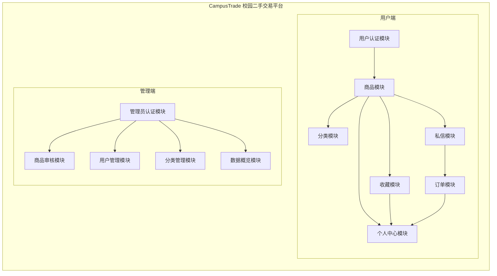

---

## 2. 用户端功能模块展开

### 2.1 用户认证模块

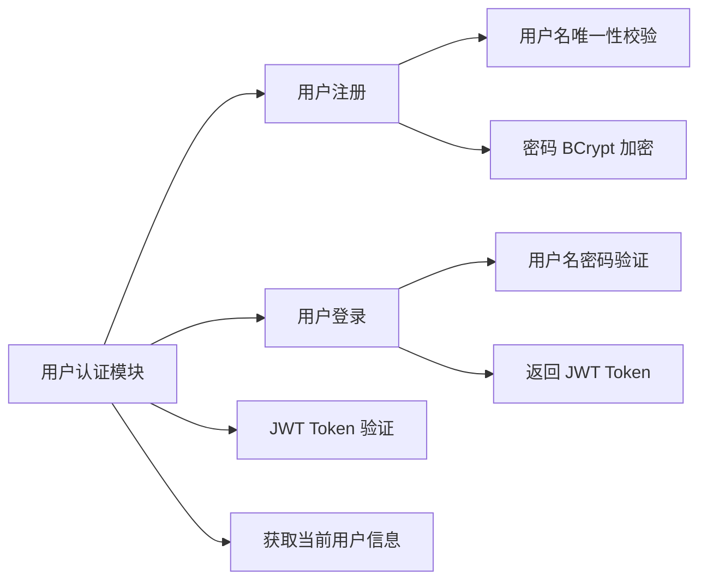

### 2.2 商品模块

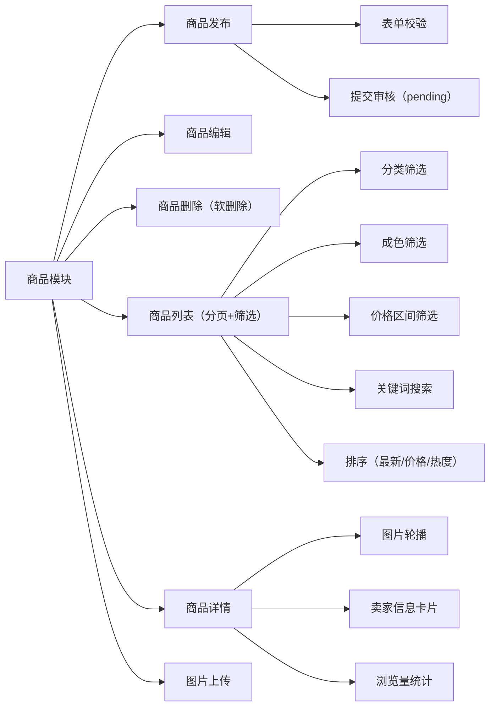

### 2.3 分类模块

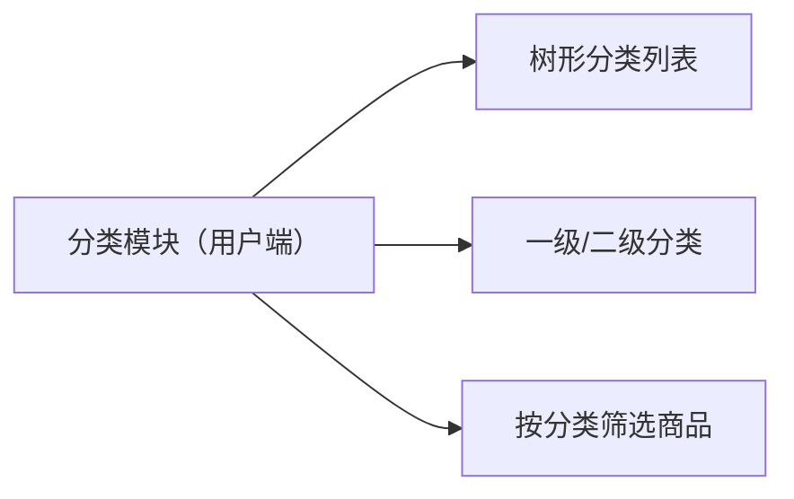

### 2.4 收藏模块

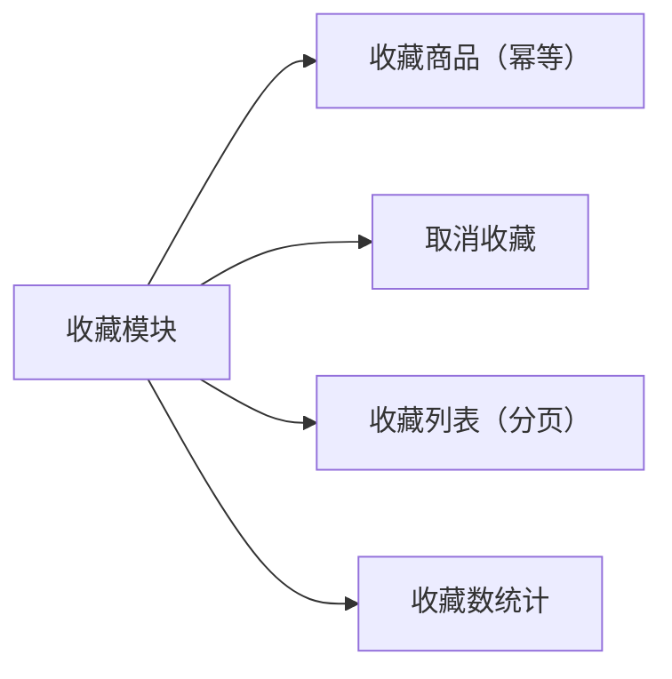

### 2.5 私信模块

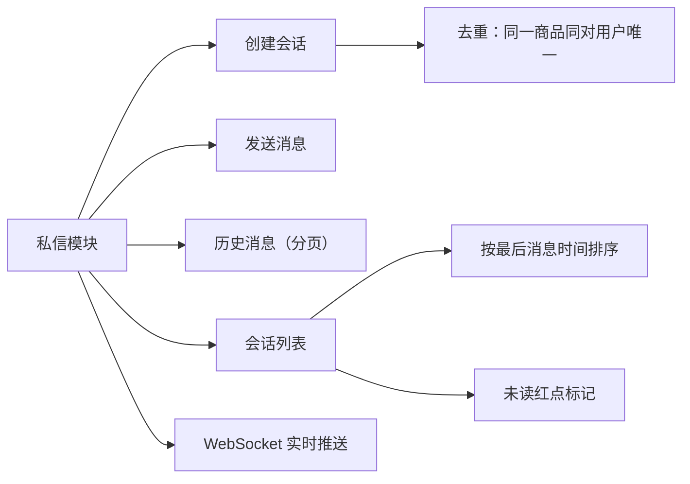

### 2.6 订单模块

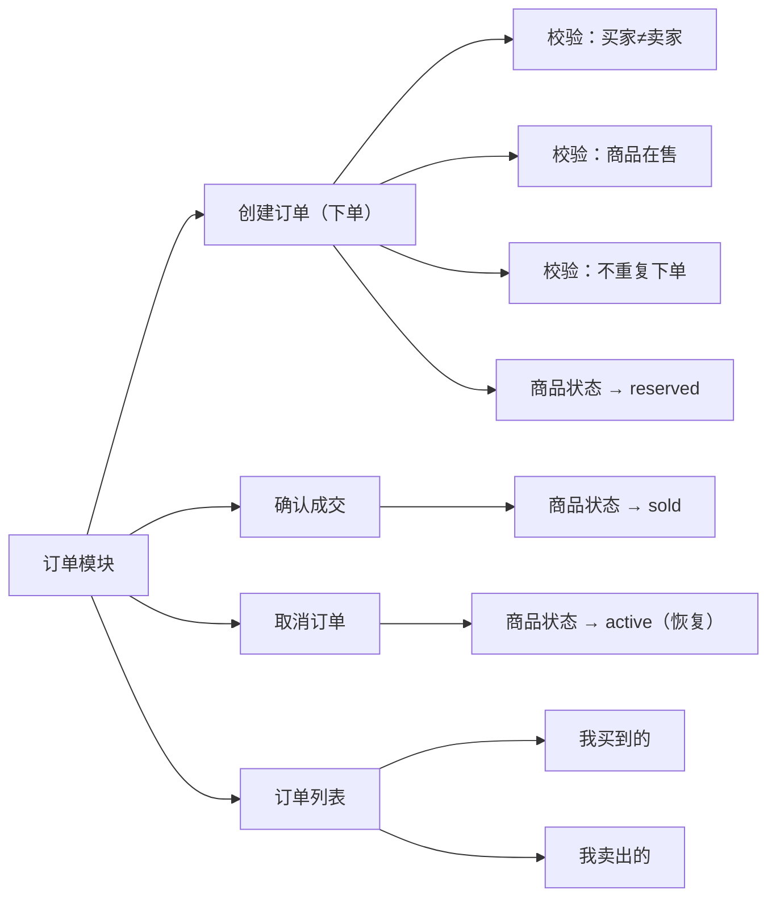

### 2.7 个人中心模块

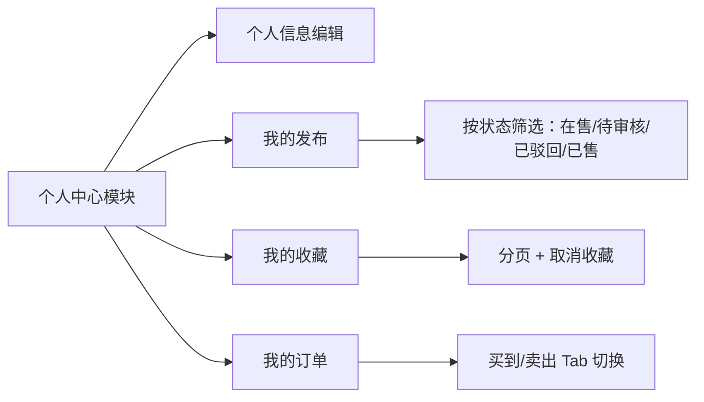

---

## 3. 管理端功能模块展开

### 3.1 管理员认证模块

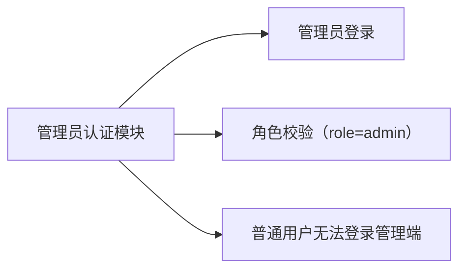

### 3.2 商品审核模块

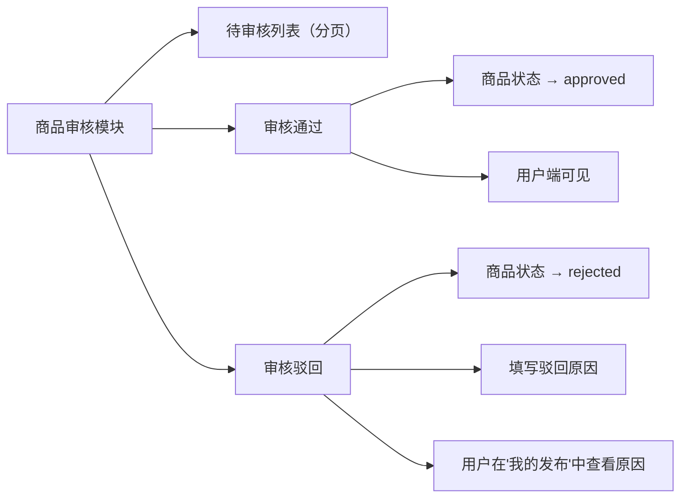

### 3.3 用户管理模块

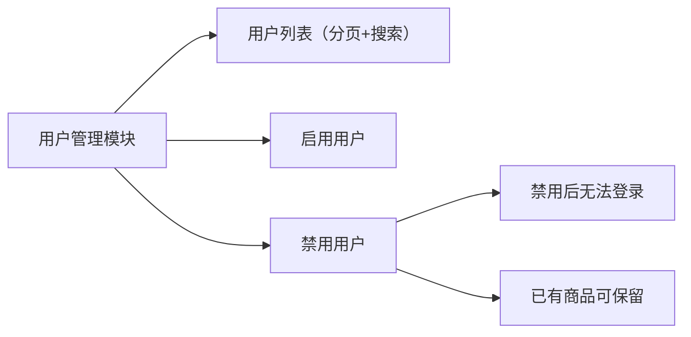

### 3.4 分类管理模块

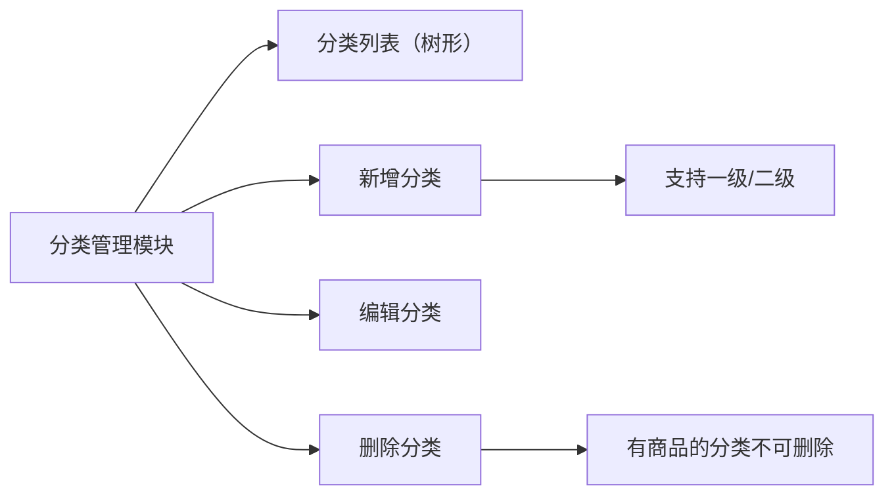

### 3.5 数据概览模块

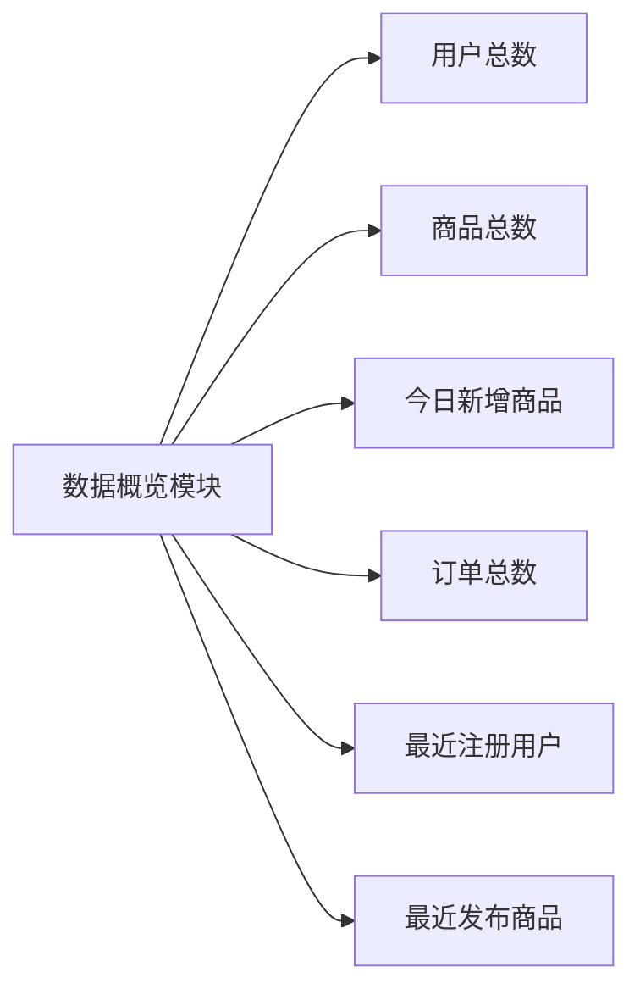

---

## 4. 模块依赖关系

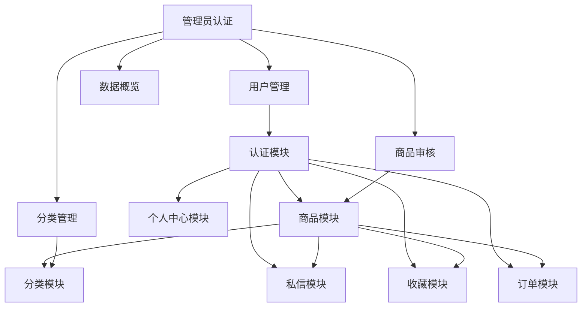

**关键依赖说明：**
- 用户端所有模块依赖认证模块（需登录）
- 商品审核模块依赖商品模块（审核的是商品）
- 订单模块依赖商品模块（下单对象是商品）
- 私信模块依赖商品模块（会话围绕商品创建）
- 用户管理模块影响认证模块（禁用=无法登录）
