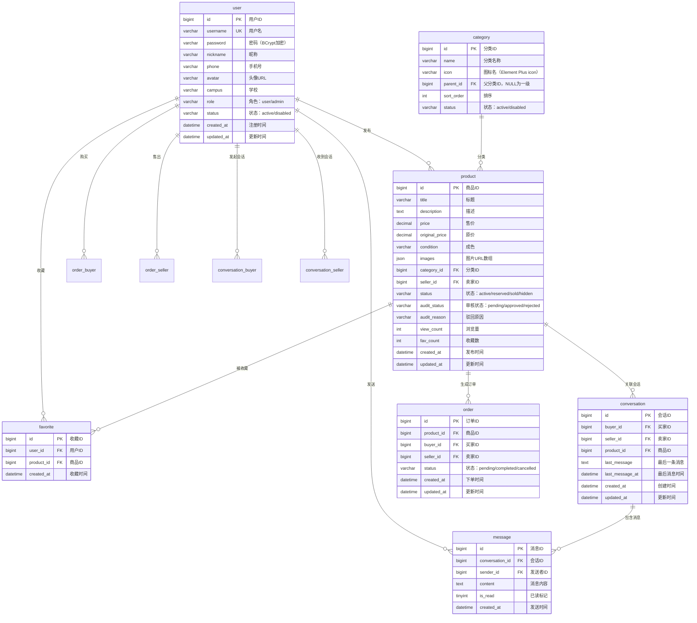

# 数据库设计

> CampusTrade 校园二手交易平台 | 2026-05-22

---

## 1. 数据库 ER 图



---

## 2. 数据库表详细设计

### 2.1 user — 用户表

| 字段名 | 类型 | 长度 | 允许空 | 默认值 | 说明 |
|--------|------|------|--------|--------|------|
| id | BIGINT | — | 否 | 自增 | 主键 |
| username | VARCHAR | 50 | 否 | — | 用户名，唯一索引 |
| password | VARCHAR | 255 | 否 | — | BCrypt 加密密文 |
| nickname | VARCHAR | 50 | 是 | — | 昵称 |
| phone | VARCHAR | 20 | 是 | — | 手机号 |
| avatar | VARCHAR | 500 | 是 | '' | 头像图片 URL |
| campus | VARCHAR | 100 | 是 | — | 学校名称 |
| role | VARCHAR | 20 | 否 | 'user' | user / admin |
| status | VARCHAR | 20 | 否 | 'active' | active / disabled |
| created_at | DATETIME | — | 否 | NOW() | 注册时间 |
| updated_at | DATETIME | — | 否 | NOW() | 更新时间 |

**索引：**
- 主键索引：`id`
- 唯一索引：`uk_username (username)`
- 普通索引：`idx_status (status)`, `idx_role (role)`

---

### 2.2 category — 分类表

| 字段名 | 类型 | 长度 | 允许空 | 默认值 | 说明 |
|--------|------|------|--------|--------|------|
| id | BIGINT | — | 否 | 自增 | 主键 |
| name | VARCHAR | 50 | 否 | — | 分类名称 |
| icon | VARCHAR | 50 | 是 | '' | Element Plus 图标名称 |
| parent_id | BIGINT | — | 是 | NULL | 父分类 ID（NULL=一级分类） |
| sort_order | INT | — | 否 | 0 | 排序值，越小越靠前 |
| status | VARCHAR | 20 | 否 | 'active' | active / disabled |

**索引：**
- 主键索引：`id`
- 普通索引：`idx_parent_id (parent_id)`

**种子数据（6个一级分类）：**

| id | name | icon | parent_id | sort_order |
|----|------|------|-----------|------------|
| 1 | 教材教辅 | Reading | NULL | 1 |
| 2 | 数码产品 | Monitor | NULL | 2 |
| 3 | 生活用品 | Goods | NULL | 3 |
| 4 | 服饰鞋包 | ShoppingBag | NULL | 4 |
| 5 | 运动户外 | Basketball | NULL | 5 |
| 6 | 其他 | More | NULL | 6 |

---

### 2.3 product — 商品表

| 字段名 | 类型 | 长度 | 允许空 | 默认值 | 说明 |
|--------|------|------|--------|--------|------|
| id | BIGINT | — | 否 | 自增 | 主键 |
| title | VARCHAR | 200 | 否 | — | 商品标题 |
| description | TEXT | — | 否 | — | 商品描述 |
| price | DECIMAL | (10,2) | 否 | — | 售价（元） |
| original_price | DECIMAL | (10,2) | 是 | NULL | 原价（元） |
| condition | VARCHAR | 20 | 否 | — | 成色：brand_new / like_new / used / worn |
| images | JSON | — | 否 | — | 图片 URL 数组，如 `["url1","url2"]` |
| category_id | BIGINT | — | 否 | — | 分类 ID，外键 |
| seller_id | BIGINT | — | 否 | — | 卖家 ID，外键 |
| status | VARCHAR | 20 | 否 | 'active' | active / reserved / sold / hidden |
| audit_status | VARCHAR | 20 | 否 | 'pending' | pending / approved / rejected |
| audit_reason | VARCHAR | 500 | 是 | NULL | 驳回原因（仅 rejected 时填写） |
| view_count | INT | — | 否 | 0 | 浏览次数 |
| fav_count | INT | — | 否 | 0 | 收藏次数 |
| created_at | DATETIME | — | 否 | NOW() | 发布时间 |
| updated_at | DATETIME | — | 否 | NOW() | 更新时间 |

**索引：**
- 主键索引：`id`
- 外键索引：`idx_category_id (category_id)`, `idx_seller_id (seller_id)`
- 普通索引：`idx_status (status)`, `idx_audit_status (audit_status)`
- 组合索引：`idx_status_audit (status, audit_status)` — 用户端列表查询常用
- 排序索引：`idx_created_at (created_at)` — 按时间排序
- 全文索引：`FULLTEXT idx_search (title, description)` — 关键词搜索

**状态流转规则：**

```
                      ┌─── 审核通过(approved)
                      │
发布 → 待审核(pending) ─┤
                      │
                      └─── 审核驳回(rejected) → 用户可查看驳回原因
                      
审核通过(approved) → 在售(active) ─┬── 被下单 → 已预定(reserved)
                                   │
                                   ├── 卖家下架 → 隐藏(hidden)
                                   │
                                   └── 卖家删除 → 隐藏(hidden)

已预定(reserved) ─┬── 卖家确认成交 → 已售(sold)
                  │
                  └── 任意方取消 → 在售(active)
```

---

### 2.4 favorite — 收藏表

| 字段名 | 类型 | 长度 | 允许空 | 默认值 | 说明 |
|--------|------|------|--------|--------|------|
| id | BIGINT | — | 否 | 自增 | 主键 |
| user_id | BIGINT | — | 否 | — | 用户 ID，外键 |
| product_id | BIGINT | — | 否 | — | 商品 ID，外键 |
| created_at | DATETIME | — | 否 | NOW() | 收藏时间 |

**索引：**
- 主键索引：`id`
- 唯一索引：`uk_user_product (user_id, product_id)` — 防止重复收藏
- 外键索引：`idx_user_id (user_id)`, `idx_product_id (product_id)`

**级联规则：** 用户删除或商品删除时，对应收藏记录自动删除（ON DELETE CASCADE）。

---

### 2.5 conversation — 会话表

| 字段名 | 类型 | 长度 | 允许空 | 默认值 | 说明 |
|--------|------|------|--------|--------|------|
| id | BIGINT | — | 否 | 自增 | 主键 |
| buyer_id | BIGINT | — | 否 | — | 买家（发起方）ID |
| seller_id | BIGINT | — | 否 | — | 卖家 ID |
| product_id | BIGINT | — | 否 | — | 关联商品 ID |
| last_message | TEXT | — | 是 | NULL | 最后一条消息内容（冗余，列表展示用） |
| last_message_at | DATETIME | — | 是 | NULL | 最后一条消息时间 |
| created_at | DATETIME | — | 否 | NOW() | 创建时间 |
| updated_at | DATETIME | — | 否 | NOW() | 更新时间 |

**索引：**
- 主键索引：`id`
- 唯一索引：`uk_buyer_seller_product (buyer_id, seller_id, product_id)` — 防止重复会话
- 普通索引：`idx_buyer_id (buyer_id)`, `idx_seller_id (seller_id)`, `idx_last_message_at (last_message_at)`

**说明：** `last_message` 和 `last_message_at` 是冗余字段，避免列表查询时 JOIN。每次发送消息时同步更新。

---

### 2.6 message — 消息表

| 字段名 | 类型 | 长度 | 允许空 | 默认值 | 说明 |
|--------|------|------|--------|--------|------|
| id | BIGINT | — | 否 | 自增 | 主键 |
| conversation_id | BIGINT | — | 否 | — | 会话 ID，外键 |
| sender_id | BIGINT | — | 否 | — | 发送者 ID，外键 |
| content | TEXT | — | 否 | — | 消息内容 |
| is_read | TINYINT | 1 | 否 | 0 | 是否已读（0=未读，1=已读） |
| created_at | DATETIME | — | 否 | NOW() | 发送时间 |

**索引：**
- 主键索引：`id`
- 组合索引：`idx_conversation_time (conversation_id, created_at)` — 历史消息查询
- 普通索引：`idx_sender_id (sender_id)`

**级联规则：** 会话删除时，对应消息自动删除（ON DELETE CASCADE）。

---

### 2.7 `order` — 订单表

| 字段名 | 类型 | 长度 | 允许空 | 默认值 | 说明 |
|--------|------|------|--------|--------|------|
| id | BIGINT | — | 否 | 自增 | 主键 |
| product_id | BIGINT | — | 否 | — | 商品 ID，外键 |
| buyer_id | BIGINT | — | 否 | — | 买家 ID，外键 |
| seller_id | BIGINT | — | 否 | — | 卖家 ID，外键 |
| status | VARCHAR | 20 | 否 | 'pending' | pending / completed / cancelled |
| created_at | DATETIME | — | 否 | NOW() | 下单时间 |
| updated_at | DATETIME | — | 否 | NOW() | 更新时间 |

**索引：**
- 主键索引：`id`
- 普通索引：`idx_product_id (product_id)` — 一个商品可有多笔订单（取消后重下单），活跃订单唯一性由 Service 层保证
- 普通索引：`idx_buyer_id (buyer_id)`, `idx_seller_id (seller_id)`

**说明：** `order` 是 MySQL 关键字，建表时需用反引号 `` `order` `` 包裹，或在 MyBatis-Plus 中通过 `@TableName("`order`")` 指定。

---

## 3. 实体关系说明

| 关系 | 类型 | 说明 |
|------|------|------|
| user → product | 1:N | 一个用户（卖家）可发布多个商品 |
| user → favorite | 1:N | 一个用户可收藏多个商品 |
| user → message | 1:N | 一个用户可发送多条消息 |
| user → order (买家) | 1:N | 一个用户可创建多个购买订单 |
| user → order (卖家) | 1:N | 一个用户可收到多个销售订单 |
| user → conversation (买家) | 1:N | 一个用户可发起多个会话 |
| user → conversation (卖家) | 1:N | 一个用户可收到多个会话 |
| category → product | 1:N | 一个分类下可有多个商品 |
| product → favorite | 1:N | 一个商品可被多人收藏 |
| product → conversation | 1:N | 一个商品可有多个购买咨询会话 |
| product → order | 1:N | 一个商品可产生多次订单（取消后可重下单；已完成/已售则不可再下单，由 Service 层控制） |
| conversation → message | 1:N | 一个会话包含多条消息 |

---

## 4. 总表量预估

| 表 | 预估数据量（1年） | 增长规律 |
|----|-------------------|----------|
| user | ~5,000 | 每学期开学季新增较多 |
| category | ~20 | 基本不增长 |
| product | ~10,000 | 毕业季/开学季高峰 |
| favorite | ~20,000 | 随商品增长 |
| conversation | ~8,000 | 约 80% 商品产生会话 |
| message | ~50,000 | 每会话平均 6 条消息 |
| order | ~3,000 | 约 30% 商品成交 |

**结论：** 数据规模在 MySQL 单表百万级以内可直接承载，无需分库分表。
